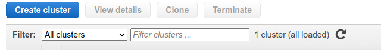
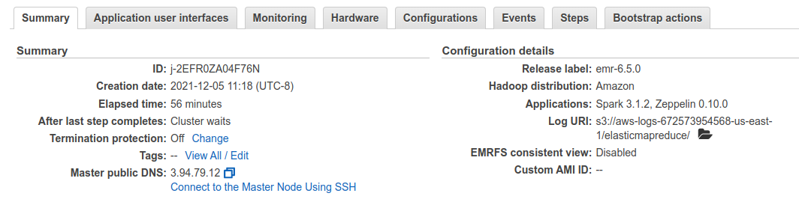

# Setup AWS EMR
## Step 1: create cluster

Click "Create cluster" button in AWS Console

### General Configuration
* Cluster name: specify your cluster name, e.g. `My cluster`
* Logging: enabled, `S3 folder` field will be pre-filled, leave it untouched.
* Launch mode: `Cluster`

### Software configuration
* Release: `emr-6.5.0`
* Applications: `Spark 3.1.2 on Hadoop 3.2.1 YARN with and Zeppelin 0.10.0`
* Use AWS Glue Data Catalog for table metadata: `No`

### Hardware configuration
* Instance type: `m5.xlarge`
* Number of instances: `3`
* Cluster scaling: `No`
* Auto-termination: `Enabled`, Terminate cluster when it is idle after `1` hour

### Security and access
* EC2 key pair: choose your EMR key
* Permissions: `Default`
* EMR Role: `EMR_DefaultRole`
  * Use EMR_DefaultRole_V2: `No`
* EC2 instance profile: `EMR_EC2_DefaultRole`

## Step 2: launch
click button "Create cluster"

# Step 3: write down information
Make sure you write down the ip address for the master node once the cluster is started.

